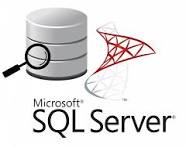
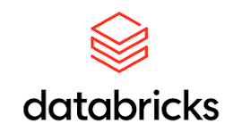

# 👋 Hi, I'm Subash Siva

 <!-- Replace with your own image or banner link -->

---

I am a dedicated **Data Analyst / Data Engineer** with over **2 years of experience** transforming data into meaningful insights and building robust pipelines. I specialize in using tools like **SQL Server**, **Power BI**, **Azure Data Factory**, **Tableau**, and **Databricks** to deliver business intelligence solutions and automate data workflows.  

I enjoy solving real-world data problems and have worked on projects involving **report automation**, **ETL pipeline development**, and **dashboarding** for performance monitoring and efficiency tracking.  

Currently enhancing my skills in **Spark**, **Azure Synapse**, and **cloud-native data platforms**.

---

- 🔍 I’m a **Data Analyst / Data Engineer**
- 💼 LinkedIn: [linkedin.com/in/subhash-s-54408724a](https://www.linkedin.com/in/subhash-s-54408724a)
- 📂 Portfolio: [GitHub Projects](https://subash0719.github.io/) 

---

### 🛠️ Languages and Tools:

  <!-- SQL Server -->
  

  <!-- Python -->
  

  <!-- Databricks -->
  

  <!-- Tableau -->
  

  <!-- Azure -->
  

  <!-- Azure Data Factory -->
  

  <!-- Power BI -->
  

  <!-- Microsoft Fabric -->
  

  <!-- Git -->
  

---

📈 _“Turning data into action is not just my job — it’s my passion.”_

